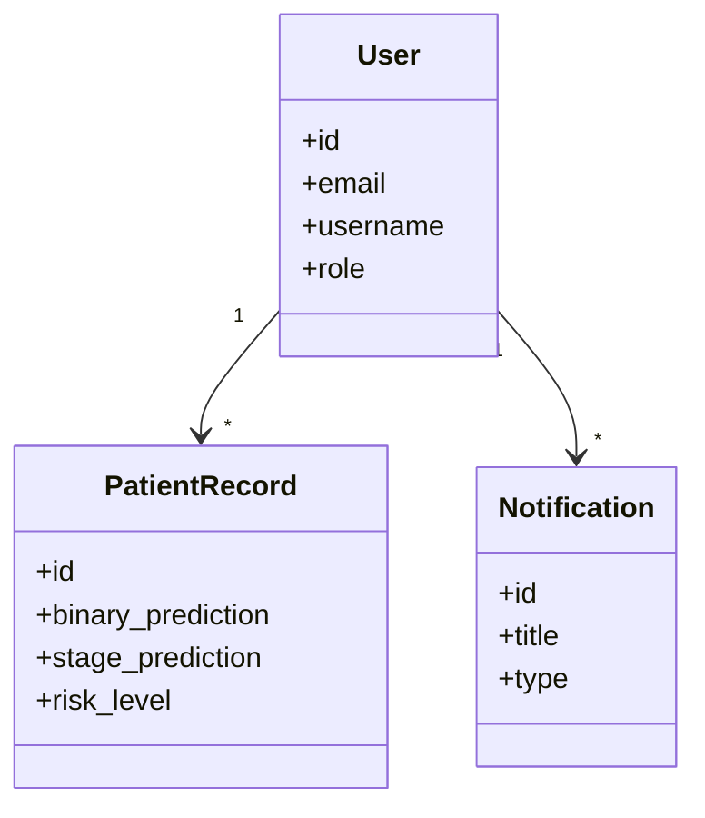
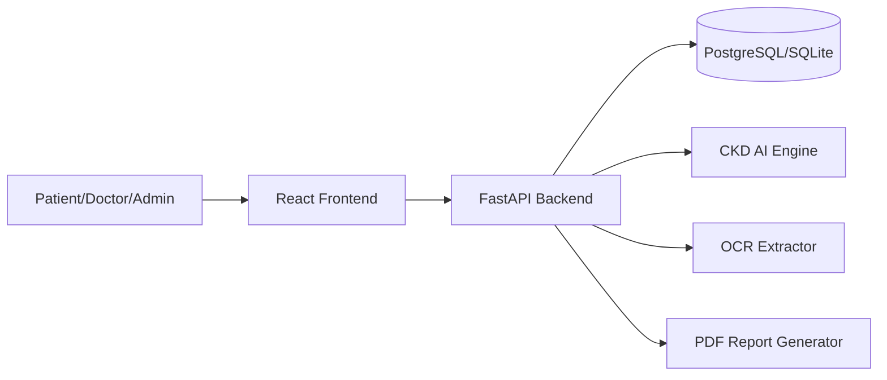
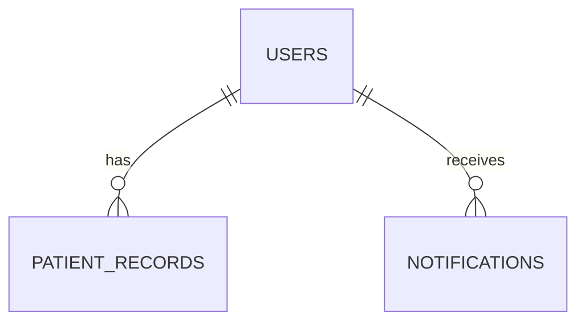

# HFSA-CKD Platform Documentation

## 1. Architecture
- Frontend: React + Tailwind + Recharts
- Backend: FastAPI REST APIs with JWT + RBAC
- DB: SQLite (development), PostgreSQL-ready for production
- AI Layer: Scikit-learn + XGBoost + Ensemble + SHAP/LIME-ready
- Deployment: Vercel (frontend), Render/Railway (backend)

## 2. Modular Folder Structure
```text
Capstone/
  backend/
    app/
      core/
      models/
      routes/
      schemas/
    main.py
    requirements.txt
  frontend/
    src/
      components/
      context/
      services/
      App.jsx
    tailwind.config.js
    postcss.config.js
  dataset/
```

## 3. UML (High Level)


## 4. DFD (Level 0)


## 5. ER Diagram


## 6. API Documentation (Major Endpoints)
- Auth:
  - `POST /api/auth/register`
  - `POST /api/auth/login`
  - `POST /api/auth/forgot-password`
  - `POST /api/auth/reset-password`
- Prediction:
  - `POST /predict`
  - `POST /api/records/predict-and-save`
  - `POST /api/records/upload-and-predict`
- Dashboards:
  - `GET /api/dashboards/patient`
  - `GET /api/dashboards/doctor`
  - `GET /api/dashboards/admin`
- Analytics:
  - `GET /api/analytics/admin`
- Recommendations:
  - `GET /api/recommendations/latest`
- Reports:
  - `POST /api/reports/medical-pdf`
- Notifications:
  - `GET /api/notifications/`
  - `POST /api/notifications/high-risk-alert`

## 7. Production Notes
1. Replace SQLite with PostgreSQL using `DATABASE_URL`.
2. Move `SECRET_KEY` to environment variables.
3. Add SMTP provider for forgot-password email delivery.
4. Add HTTPS, rate-limiting, and audit logging.
5. Add CI/CD pipelines for frontend and backend deployment.
